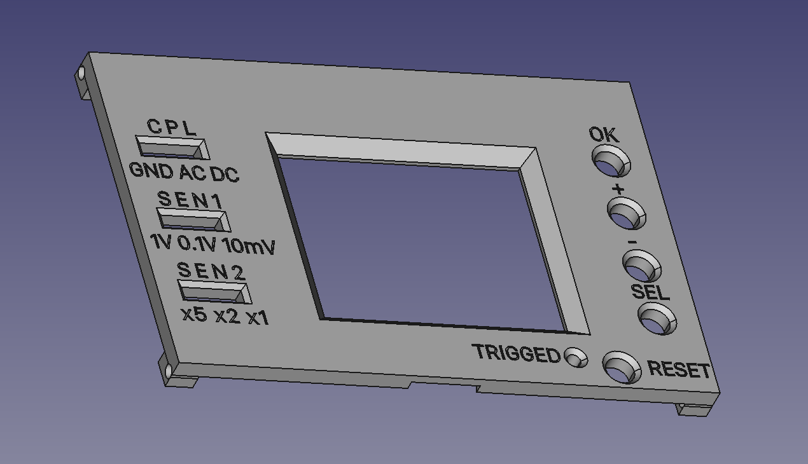
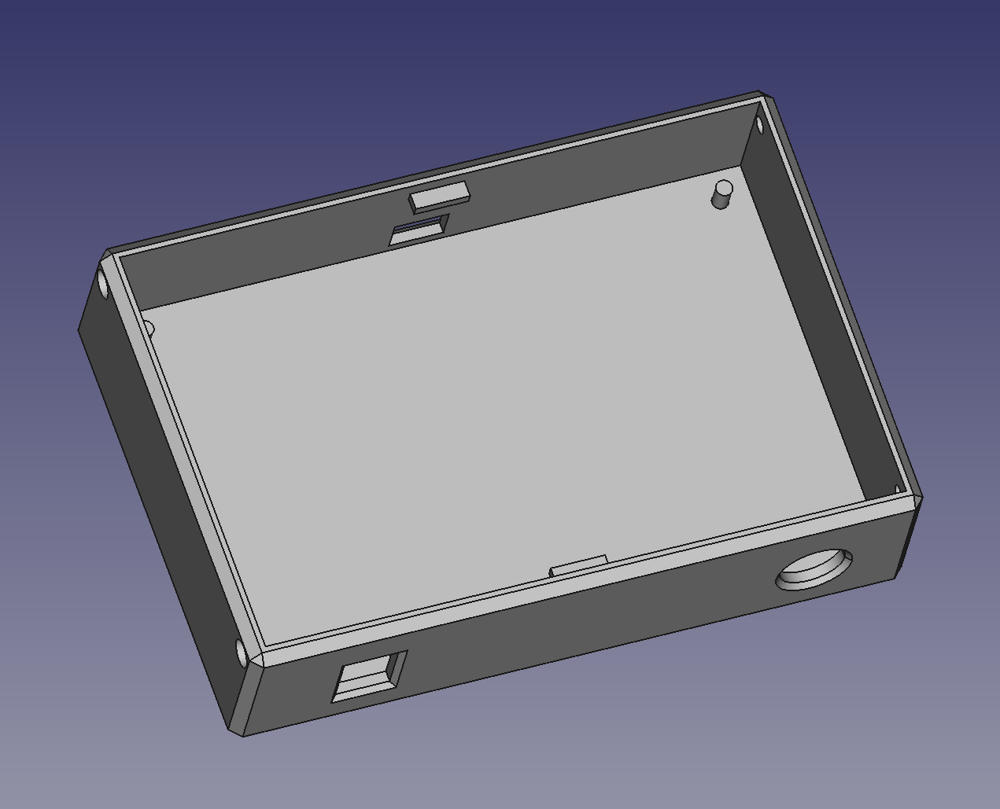
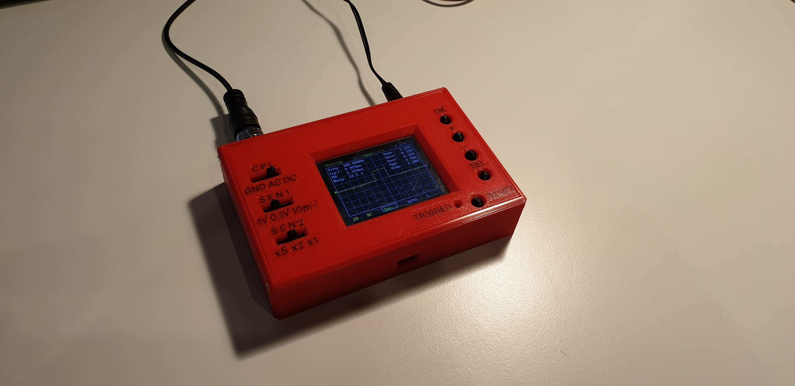

# OSD-FNIRSI-138-Cover
Cover for oscyloscope FNIRSI-138 ready to be 3D printed

Recently I've bought the FNIRSI-138 oscyloscope from the popular chinese online shop :-) but unfortunatley I ordered version without cover for it, it happens. I decided to print own one on my 3D printer, so I created model using [FreeCAD](https://www.freecadweb.org/).

I'm still newbie in FreeCAD and 3D modeling, but this cover looks okay and it's works as expected!

# My printer settings for this model

* Printer: Creality Ender 5 with Marlin 2.x on board
* Material: PLA
* HotEnd temperature: 200'C
* Bed temperature: 60'C
* Infill: 100%

To print front part you should use two different colors of material, one for text (first layer) and second for others. I'm using [Cura](https://ultimaker.com/software/ultimaker-cura) for slicing models. I've added two models (front-text.stl and front-frame.stl) into one gcode and add [M600](https://marlinfw.org/docs/gcode/M600.html) (it can not work on your printer if you do not upload [Marlin](https://marlinfw.org/) firmware to it with proper configuration) code manualy between them. Thanks to that I was able to change color between text and other parts.

# Photos
## Front

## Bottom

## Real photo (after print ans assambling)

# Notice
This is my first open-source 3D project, please use with caution :-) No warranty is given.
